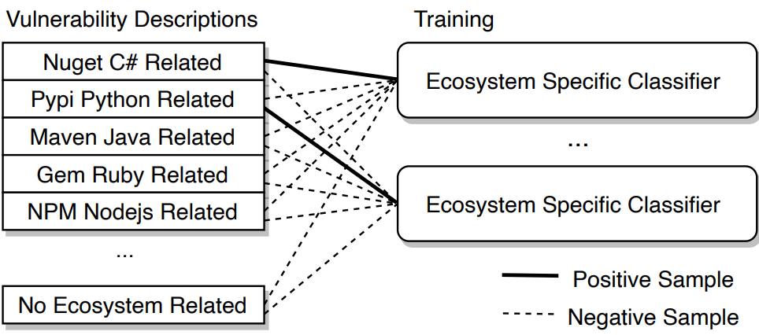
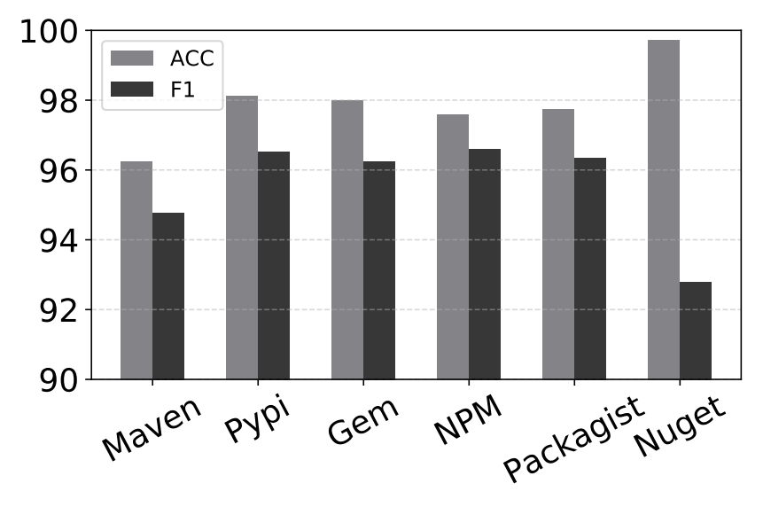

#### Ecosystem Classifier (EC)

- overview of EC module

##### How EC work?
A vulnerability report is written in natural language, which is too complicated for handcraft features to classify its ecosystem. To this end, we develop a deep neural network (DNN) model for each ecosystem to capture long-term dependencies of textual words and classify reports.

##### Preprocessing
We use the CPE string and a textual description in the report as the input. The report description is to detail and summarize the relevant information of the vulnerabilities. We convert every word in the plaintext into a token. The CPE string has 12 fields, each of which is divided by a colon, such as the ``vendor`` field and ``product`` field. Every field is converted into a word token. We use those word tokens as the input of the DNN model. We transfer the word tokens to vectors, called word embedding, for machine learning algorithms. The word embedding represents the semantic content and characteristics of the textual information in a real-valued continuous vector space. In short, the preprocessing converts a textual input into a vector for the classification model.

##### DNN model
We utilize a recurrent neural network (RNN) to learn and derive the classification. RNN leverages a long short-term memory (LSTM) in the network to capture the inputs' long-term dependencies. Particularly, LSTM uses three gates (input gate, forget gate, and output gate) to store long-term dependencies of textual words. We connect an LSTM with a fully-connected layer, followed by a softmax layer, which outputs the ecosystem category's probability. Here, we train the models for each ecosystem individually. We choose the maximum probability as the output for the vulnerability report.

#### EC module result (random seed)

##### Ecosystem gem

- ACC: 0.9826589595375722
- precision: 0.8796992481203008
- recall: 0.9831932773109243s
- F1: 0.9285714285714285

##### Ecosystem npm

- ACC: 0.9498553519768563
- precision: 0.933852140077821
- recall: 0.8727272727272727
- F1: 0.9022556390977443

##### Ecosystem nuget

- ACC: 0.9961389961389961
- precision: 0.625
- recall: 0.8333333333333334
- F1: 0.7142857142857143

##### Ecosystem packagist

- ACC: 0.9681774349083896
- precision: 0.9455445544554455
- recall: 0.8967136150234741
- F1: 0.9204819277108435

##### Ecosystem pypi

- ACC: 0.9691119691119691
- precision: 0.953307392996109
- recall: 0.9245283018867925
- F1: 0.9386973180076628

##### Ecosystem maven

- ACC:  0.983502538071066
- precision:  0.9321428571428572
- recall:  0.9738805970149254
- F1:  0.9525547445255474