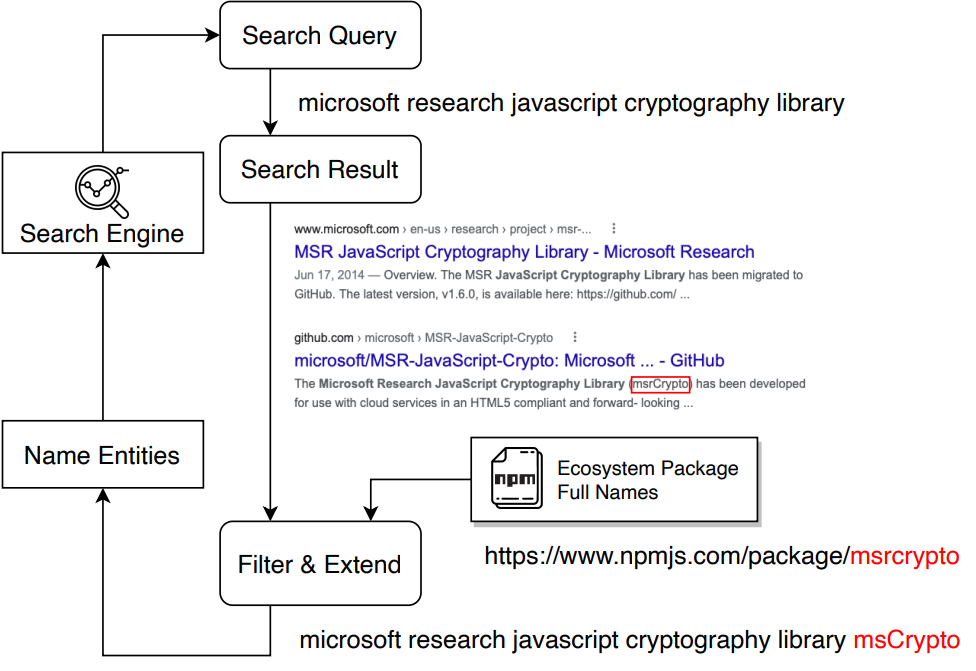

#### Package Entity Search & Extend (PESE)

- overview of PESE module

##### How PESE work?

To fill in the vulnerability report's missing information, we have a practical observation that today's search engines rank web pages based on the correlated degree between a search query and a search engine result.

If we utilize those entities extracted by the PET module as the search query to a search engine, the search results may contain the missing package names of software ecosystems. Then, the problem is how to identify which part of the search results are the missing package names. Here, we leverage a trick that a software ecosystem provides the package index dataset to the public. If the content of the search result appears in the package index dataset, we extract the related words as the package-related entities for filling in the missing information. Hence, the PESE further extends those entities extracted by PEE by utilizing the search engine's search result.

Figure above depicts how the PESE module find more package-related entities for generating package identifier of a software ecosystem.First, we use all package-related entities extracted from a vulnerability report as the search query. We send the search query to a search engine and gain the search result that has a high correlation with package-related entities. Second, we collect the ecosystem package index dataset.