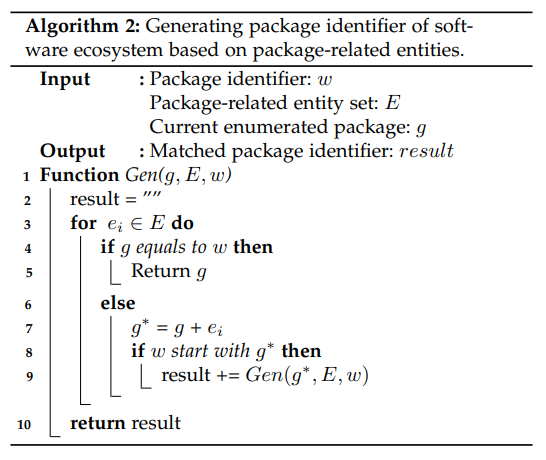
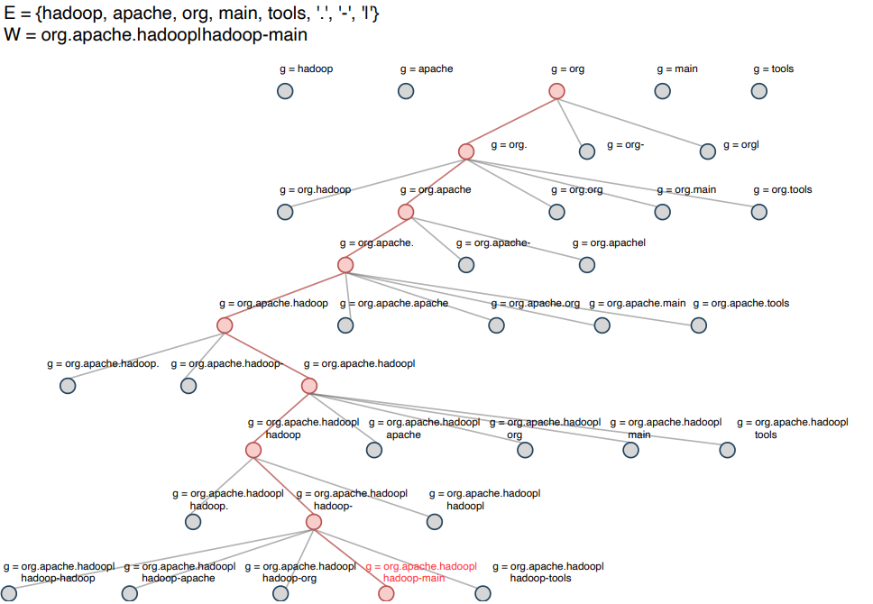

#### Package Identifier Generation (PIN)

- algorithm of PIN module

---

- case of PIN module

##### How PIN work?
A package identifier is unique for representing a software package in an ecosystem. Every software ecosystem contains its own namespace, and we use the Trie tree to index the ecosystem package name dataset. Given an ecosystem’s namespace, the PIN module generates package identifiers based on those package-related entities from the PESE module.