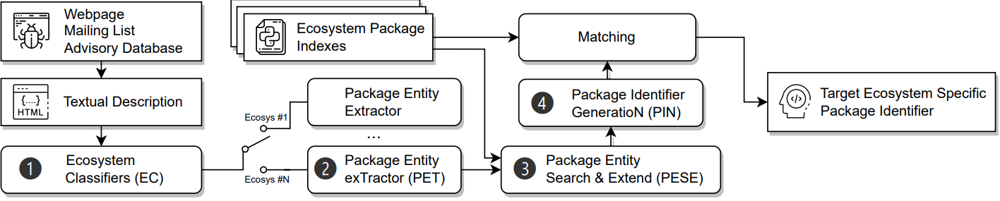

#### PKVIC: software Package Vulnerability Information Calibration

---

---

##### What is PKVIC?
We propose a framework called `PKVIC` (software Package Vulnerability Information Calibration) to establish the information connection between vulnerability reports and software packages of ecosystems. PKVIC consists of four major components to address above challenges.
- To deal with diverse naming schemes of different ecosystems, 
 we propose a novel ecosystem classifier. Given a vulnerability report, the classifier determines which ecosystem the report belongs to.
- To accurately extract package-related entities from textual descriptions, for each ecosystem, PKVIC automatically generates an NER corpus and then builds an NER model.
- To address the problem that those entities cannot constitute the package's full-name, we propose to extend those entities via today's search engines and generate a candidate set for the full coverage of package names.
- For efficient and accurate matching, PKVIC uses a recursive traversal method to generate a package identifier based on the naming scheme and entity candidate set. Every ecosystem has its naming scheme and package identifier index dataset. In particular, we compare the generated identifiers with those in the ecosystem package dataset. If matched, PKVIC outputs a software package identifier for the vulnerability report.
